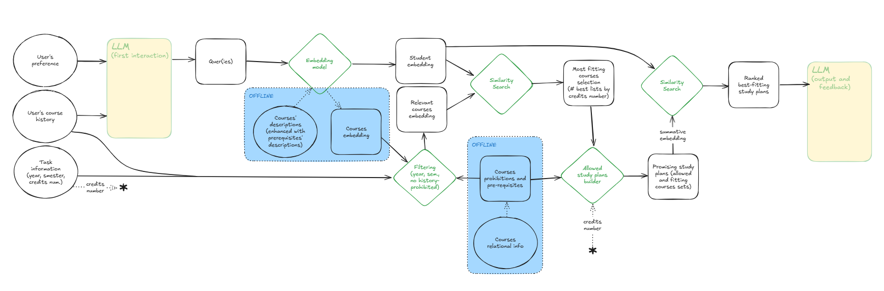

# UoE Study Plan Assistant

The present AI-based model can help students in defining the set of courses to attend during any specific semester of their career, based on their background, interests and skills. The UI allows to define their preferences via user-friendly filters and natural language interaction.

## To run the code (from relevant diretory):

### Frontend
npm start

### Backend
uvicorn main:app --reload --port 8000

### Ollama
ollama pull llama3.1 & ollama serve

## Pipeline:

